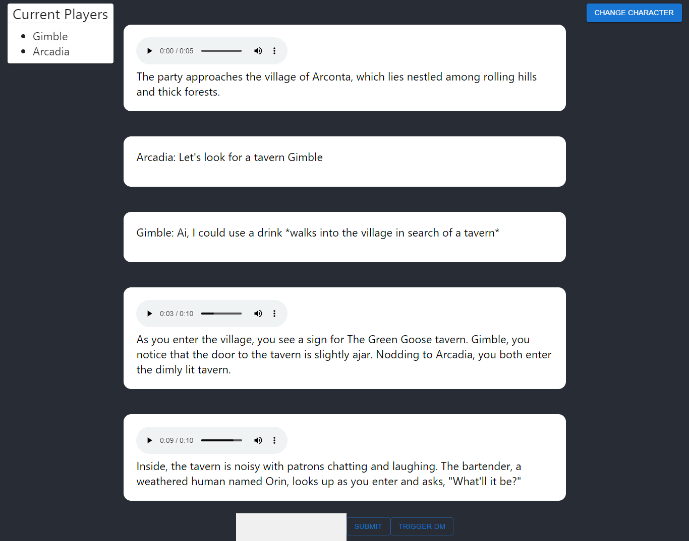

# DND AI

Fun little application to have an AI be a DM for you and your friends. Create characters, send messages, then trigger your AI to respond.



Uses web sockets to sync messages between clients.

## Run server
1. Change the endpoint for the OpenAI API in `./web-server/api/setupWebSockets.js` if necessary, default is localhost.
1. Change the `./web-server/context.txt` file to your liking to affect the story.
1. Add a settings.json file to configure endpoints (example file is in settings-example.json)
1. Navigate to the react-app folder and run the commands `npm install` and `npm run build` to generate the build folder.
1. Navigate to the web-server folder and run the commands `npm install` and `node server.js`. The server should be running now (default port is 9000).

## How to Use the UI
On load of the page you should get a modal asking for a character name and description. This will be provided as context to the LLM.

Once you set a character name and description you can type in a message in the text box at the bottom of the screen. Hitting send sends this message to all players on the page. Pressing "Trigger DM" calls the AI endpoint with all of the current messages and context.

You are able to change your current character by pressing the change character button on the top right of the screen.

Obviously the quality of the responses will vary significantly depending on the model you are using, and there's not guarantee you get something coherent.

## Settings
The following is the available configurable settings in the web server settings.json file

```
{
    "apiUrl": "http://127.0.0.1:5000",
    "piperPath": "C:\\piper\\piper.exe",
    "piperModel": "en_GB-cori-high.onnx",
    "type": "oobabooga", // Right now supports oobabooga, chatgpt
    // only used for oobabooga
    "characterName": "DND",
    // only used for chatgpt apis
    "apiKey": "xxxxxxxxxxxxx"
    // only used for chatgpt apis
    "model": "gpt-4o"
}
```

## Valid API Endpoints
This web page was designed specifically to call the oobabooga webui `/v1/chat/completions` [api](https://github.com/oobabooga/text-generation-webui/wiki/12-%E2%80%90-OpenAI-API) on localhost, but it should theoretically work for any [openai api](https://platform.openai.com/docs/api-reference/chat/create). I have only tested with oobabooga though.

## TTS
You can provide a path to [piperTTS](https://github.com/rhasspy/piper) to allow for AI messages to have TTS. Piper is a fast but still decent tts provider.

To enable piper:
1. Download the piper executable to anywhere on your computer.
2. Download any models you want to use to `./web-server/piperModels`.
3. Within `./web-server/api/setupWebSocket.js` change the `piperPath` variable to the path to your executable (e.g. `C:/piper/piper.exe`).
4. Within `./web-server/api/setupWebSocket.js` change the `piperModel` variable to the name of the model within piperModels you want the DM to use.

Note that audioFiles are saved to the `./web-server/audioFiles` folder.